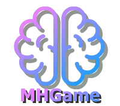
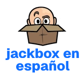

  
# ✨Greetings!✨

 

  I'm Felipe Arroyo, a recently graduated Systems Engineer looking to develop a variety of side projects to expand my skill set, learn new technologies, and grow my portfolio.

## Projects

| Project | Description | Tech Stack |
| :--- | :--- | :--- |
| **** | Open-source, ad-free version of the party game for Android and Windows |   |
| **** | Application showcasing a serious game for facilitating cognitive evaluation |      |
| ** (admin app)** | Web application to customize and control MHGame activities |   |
| **** | Prompt editor for the Fibbage: Enough About You series |  |
| **** | Website for the Jackbox en español translation project |   |
| **** | Poker Planning subsection of the AgileTalk project |    RASA |
| **[Decision Tree](https://github.com/feliarroyo/arbol-decision-imdb)** | Decision Tree based on personal TV/movie recommendations |    |
